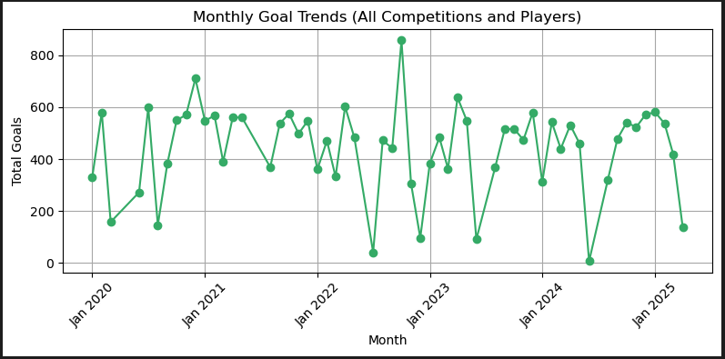
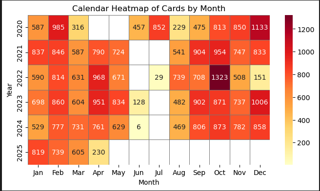
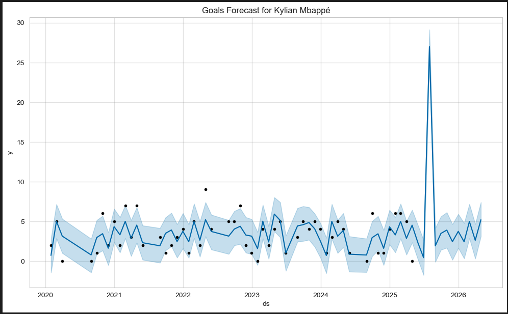

# ⚽ Football Player Performance Analysis

This project analyzes football player performance metrics using data science techniques to uncover insights about player statistics and game outcomes.

## 📊 Dataset

The analysis uses the **Player Scores** dataset from Kaggle:  
[Football Dataset](https://www.kaggle.com/datasets/davidcariboo/player-scores)

### Download Instructions

To download the dataset programmatically:

python
import kagglehub

# Download the dataset
path = kagglehub.dataset_download("davidcariboo/player-scores")
print("Dataset downloaded to:", path)´´´

## 📁 Project Structure

- `notebooks/`: Jupyter Notebooks with exploratory analysis
- `data/`: Raw and processed data files
- `scripts/`: Python scripts for data processing and visualization

## ⚙️ Tools Used

- Python (pandas, matplotlib, seaborn, scikit-learn)
- Jupyter Notebook

## 🚀 How to Run

1. Clone this repo
2. Install requirements: `pip install -r requirements.txt`
3. Open notebooks or run scripts

## 📈 Sample Output

---

## 👤 Author

Mahmudur Rahman
